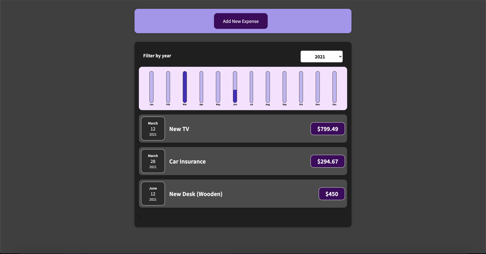

# ExpensesTracker



[Demo Link - Netlify](https://nervous-shaw-148c7b.netlify.app/)

> Use ExpensesTracker to track monthly and yearly expenses. Very simple to use, all you need do is enter the details of the expenses made with date and, voila! ExpensesTracker handles the rest. Built with React Library, HTML, CSS, and JavaScript, it has a bar chart feature that gives a pictorial overview of the expenses based on selected year.


Additional description about the project and its features.

## Built With

- Major languages (HTML, CSS, JavaScript)

- Frameworks / Libraries
  ```bash
  - React Library
  ```

- Technologies used 
  
  ``` bash
  - Git(version control)
  ```


## Getting Started

To get a local copy up and running follow these simple example steps.

### Prerequisites
 - A text editor(preferably Visual Studio Code)

### Install
  -  [Git](https://git-scm.com/downloads)
  -  [Node](https://nodejs.org/en/download/)

### Usage
#### Clone this repository

```bash
$ git@github.com:clintonjosephs/ExpensesTracker.git
$ cd ExpensesTracker
```
#### Run project

```bash
$ npm install
$ npm build
$ npm start
```

#### Open page in browser
```bash
$ runs on http://localhost:3001/
```

## Authors

👤 **Clinton Mbonu**

- GitHub: [@clintonjosephs](https://github.com/clintonjosephs)
- LinkedIn: [LinkedIn](https://linkedin.com/in/clinton-mbonu)

## 🤝 Contributing

Contributions, issues, and feature requests are welcome!

Feel free to check the [issues page](https://github.com/clintonjosephs/ExpensesTracker/issues).

## Acknowlegments
- Udemy Course - [React, the complete guide](https://www.udemy.com/course/react-the-complete-guide-incl-redux/)

## Show your support

Give a ⭐️ if you like this project!

## 📝 License

This project is [MIT](https://opensource.org/licenses/MIT) licensed.